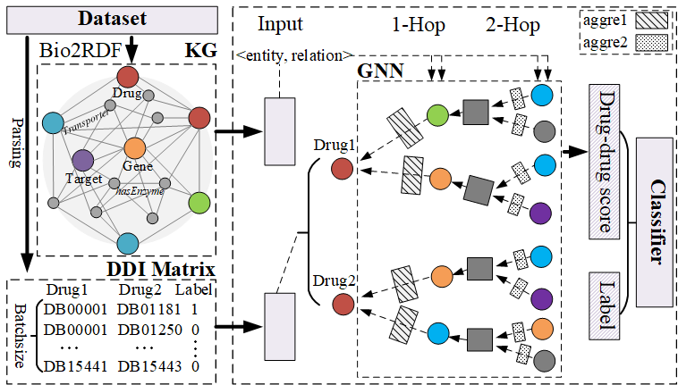

# Knowledge Graph Neural Network
This is our implementation for the paper
> Xuan Lin, Zhe Quan, Zhi-Jie Wang, Tengfei Ma and Xiangxiang Zeng. KGNN: Knowledge Graph Neural Network for Drug-Drug Interaction Prediction. IJCAI' 20 accepted.


Figure 1 shows the overview of KGNN. It takes the parsed DDI matrix and knowledge graph obtained from preprocessing of dataset as the input. It outputs the interaction value for the drug-drug pair. 

# Requirement
To run the code, you need the following dependencies:
* Python == 3.6.6
* Keras == 2.3.0
* Tensorflow == 1.13.1
* scikit-learn == 0.22

# Installation
You can create a virtual environment using [conda](https://github.com/conda/conda).
```bash
conda create -n kgnn python=3.6.6  
source activate kgnn  
git clone https://github.com/xzenglab/KGNN.git  
cd KGNN  
pip install -r requirement.txt  
```

# Dataset
We just provide the preprocessed KG from KEGG dataset owing to the size limited. You can directly download the original DrugBank dataset ([V5.1.4](https://www.drugbank.ca/releases/5-1-4)). The construction of KG please refer to [Bio2RDF](https://github.com/bio2rdf/bio2rdf-scripts/wiki) tool in detail.

# Usage
```bash
python run.py
```

# Citation
```bash
@inproceedings{ijcai2020-380,  
  title     = {KGNN: Knowledge Graph Neural Network for Drug-Drug Interaction Prediction},  
  author    = {Lin, Xuan and Quan, Zhe and Wang, Zhi-Jie and Ma, Tengfei and Zeng, Xiangxiang},  
  booktitle = {Proceedings of the Twenty-Ninth International Joint Conference on Artificial Intelligence, {IJCAI-20}},  
  publisher = {International Joint Conferences on Artificial Intelligence Organization},               
  editor    = {Christian Bessiere},    	
  pages     = {2739--2745},    
  year      = {2020},  
  month     = {7},  
  note      = {Main track},  
  doi       = {10.24963/ijcai.2020/380},  
  url       = {https://doi.org/10.24963/ijcai.2020/380},  
}  
```

For any clarification, comments, or suggestions please create an issue or contact [Jacklin](Jack_lin@hnu.edu.cn).
